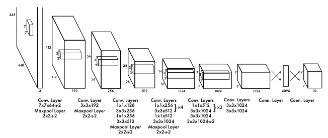
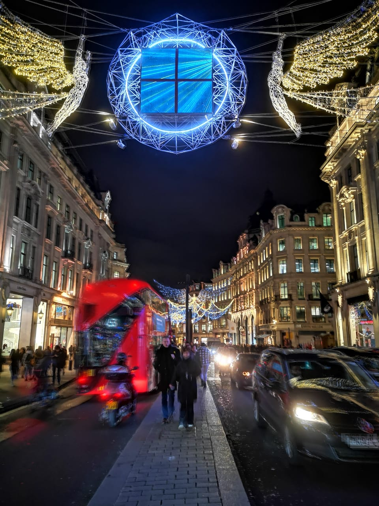
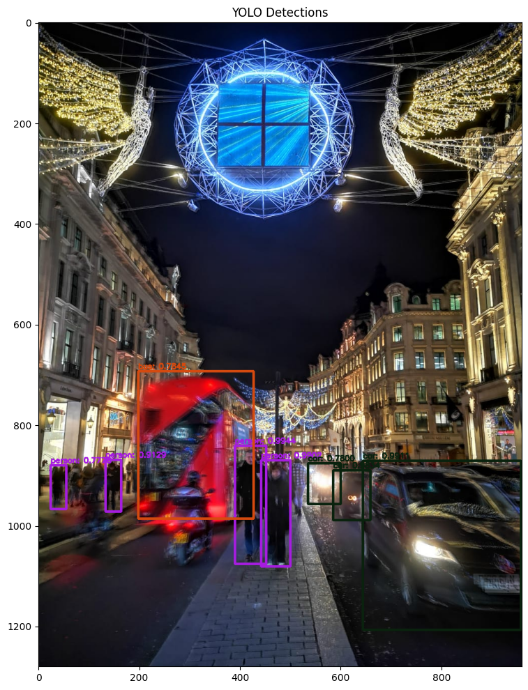

# YOLOv3 Object Detection using OpenCV

This repository demonstrates how to use the YOLOv3 model for object detection with OpenCV's `cv2.dnn` module. The code showcases how to load pre-trained YOLOv3 weights, perform inference on images, and visualize the results with bounding boxes and class labels.

---
## Architecture

YOLOv3 (You Only Look Once, Version 3) is a convolutional neural network architecture designed for real-time object detection. It divides the input image into a grid and predicts bounding boxes and class probabilities for each grid cell. The network is composed of Darknet-53 as the backbone, which consists of 53 convolutional layers trained on the ImageNet dataset, and additional layers to detect objects at three different scales. This multi-scale feature extraction allows YOLOv3 to detect small, medium, and large objects more effectively. The architecture employs anchor boxes, residual connections, and upsampling to enhance accuracy while maintaining high inference speed, making it suitable for real-time applications.


---
## Features

- Load pre-trained YOLOv3 weights and configuration files.
- Utilize the COCO dataset's class labels for object detection.
- Create image blobs for efficient processing.
- Perform forward passes with YOLOv3 using OpenCV.
- Apply non-maximum suppression to eliminate redundant bounding boxes.
- Display results with labeled bounding boxes on images.

---

## Steps Involved

1. **Download Pre-trained YOLOv3 Weights:**
   - [Download YOLOv3 weights (237MB)](https://pjreddie.com/media/files/yolov3.weights)

2. **Set Up the Model:**
   - Load the COCO dataset class labels (`coco.names`).
   - Initialize the YOLOv3 network with weights (`yolov3.weights`) and configuration (`yolov3.cfg`).

3. **Process Images:**
   - Transform images into blobs using `cv2.dnn.blobFromImage`.
   - Perform inference to detect objects and classify them.

4. **Post-Processing:**
   - Use non-maximum suppression to refine bounding boxes.
   - Visualize detections with bounding boxes and labels using OpenCV.

---

## Dependencies

- Python 3.x
- OpenCV
- NumPy
- Matplotlib

Install dependencies with:

```bash
pip install opencv-python numpy matplotlib
```

---

## Usage

1. **Clone the Repository:**

   ```bash
   git clone https://github.com/SamamaSaleem/YOLOv3-Object-Detection-using-OpenCV/tree/main/yolov3-opencv
   cd yolov3-opencv
   ```

2. **Prepare Data:**
   - Place test images in the `images/` folder.
   - Download [the YOLO model](https://drive.google.com/file/d/1dQxuJjU6ug_XPinlxblJblQrvxcvIugx/view?usp=drive_link)

3. **Run the Script:**
   - Execute the detection script:

   ```bash
   python yolov3_detection.ipynb
   ```

4. **Visualize Results:**
   - Detected objects will be displayed with bounding boxes and labels.

---

## Example Output

Below are examples of detections:

### Input Image


### Output Image with Detections


---

## Code Highlights

### Loading YOLOv3 Model
```python
net = cv2.dnn.readNetFromDarknet(cfg_path, weights_path)
net.setPreferableBackend(cv2.dnn.DNN_BACKEND_OPENCV)
```

### Blob Creation
```python
blob = cv2.dnn.blobFromImage(image, 1/255.0, (416, 416), swapRB=True, crop=False)
net.setInput(blob)
```

### Non-Maximum Suppression
```python
indices = cv2.dnn.NMSBoxes(boxes, confidences, score_threshold=0.5, nms_threshold=0.3)
```

---

## References

- [YOLOv3 Weights and Config Files](https://pjreddie.com/darknet/yolo/)
- [OpenCV Documentation](https://docs.opencv.org/master/index.html)

---

